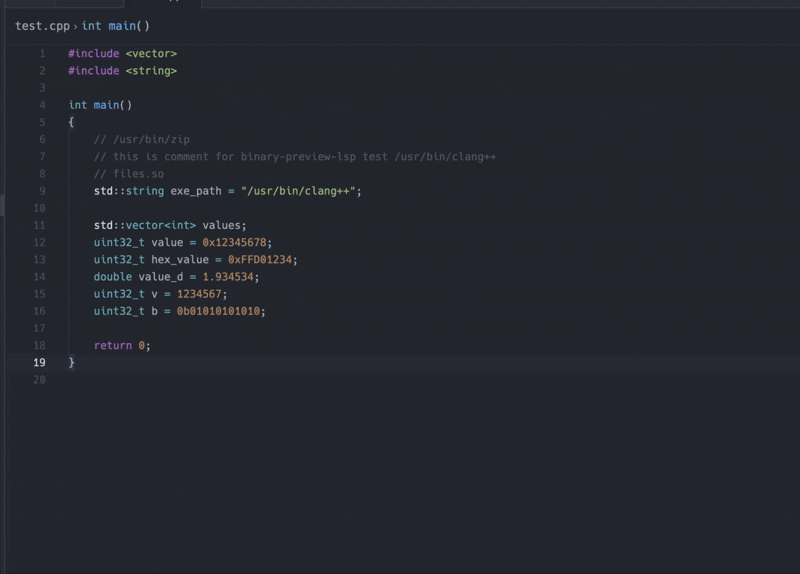

# Binary Preview

Binary Preview is a language server that adds hover information for numeric
literals and binary file paths in source code.

For recognized binary files, the hover shows the file size, a header hex dump,
and format-specific information for PE, ELF, Mach-O, and archive files.

## Why a language server?

The original goal of Binary Preview is to let users select an executable or
library file in Zed and display its analyzed contents directly in a dedicated
editor view.

Zed's extension API does not currently provide an API for extensions to create
custom editor views or GUI panels for arbitrary binary files. To provide useful
binary inspection within the APIs that are available today, Binary Preview is
implemented as a Language Server Protocol (LSP) server.

Instead of opening the binary itself, users can hover over a binary file path in
a supported source file. The language server resolves the path, analyzes the
file, and returns the result as Markdown hover information. Numeric literals are
also decoded through the same hover mechanism.

This is a compatibility-oriented implementation rather than the final intended
binary-editor experience. If Zed exposes custom editor or binary-view APIs in
the future, the analysis logic can be reused to provide the original direct
file-view workflow.

## Zed extension

The Zed extension is located in [`zed-extension`](zed-extension). It supports
C, C++, Rust, and Python files and downloads the matching
`binary-preview-lsp` executable from this repository's GitHub Releases.

Prebuilt executables are published for:

- Windows x86_64
- Linux x86_64
- macOS x86_64
- macOS Apple Silicon

## Supported features

- Source languages: C, C++, Rust, and Python
- Decimal, hexadecimal (`0x`), and binary (`0b`) integer literals
- Decimal floating-point and scientific notation
- Binary file paths in quoted and unquoted source text
- PE, ELF, Mach-O, Universal Mach-O, and archive file summaries
- File size and the first 64 bytes as a hex dump

## Known limitations

Numeric literal parsing currently supports a common subset of C-like syntax
rather than each language's complete grammar.

- Python octal, underscore-separated, complex, and arbitrary-precision integer
  literals are not fully supported.
- Rust type suffixes and underscore-separated literals are not yet supported.
- Unary signs are not included in numeric literal analysis.
- String escape sequences are not decoded when resolving file paths.
- Binary files are inspected through source-code hover information; Zed does
  not currently open them in a custom binary editor view.

## License

MIT
